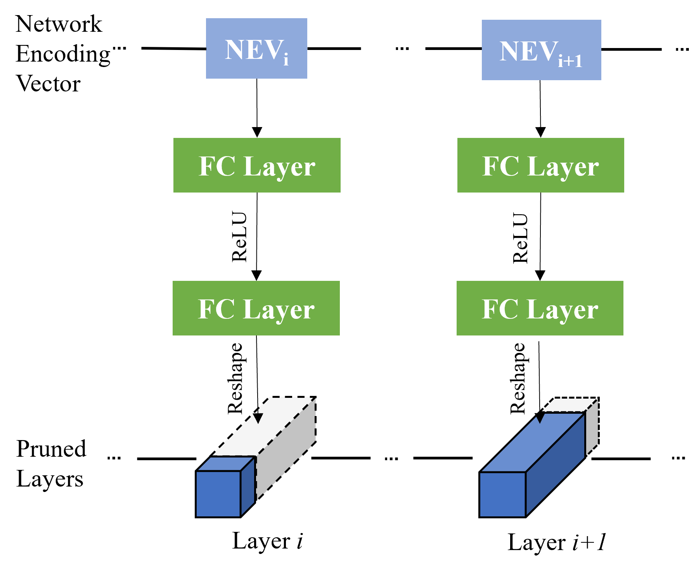
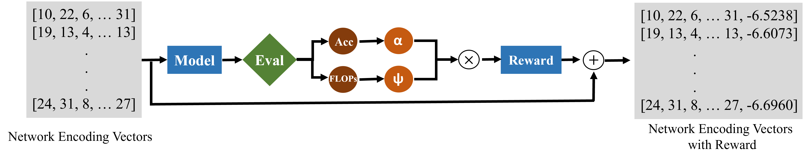

# Rewarded Meta-pruning

This is the PyTorch implementation of our paper "Rewarded meta-pruning: Meta Learning Using Rewards for Channel Pruning".



The reward is computed as follows




## Execution

There are three parts to each network; Training stage, Searching stage and Finetuning stage. Training dataset (ImageNet) should be stored in `./ImageNet2012`

### 1. Training

```bash
python train.py --data='./ImageNet2012' | tee -a log/training.txt
```
Running this code creates a file `model_best.pth` in `.\training\models`. Once this file has been created, proceed to the second stage.

### 2. Searching

```bash
python search.py --max_iters=20 --net_cache='./training/models/checkpoint.pth.tar' --data='./ImageNet2012' | tee search.txt
```
Running this code finds the best NEV candidates. These are displayed in the output and saved in the `search.txt` file as the top-10 NEVs of the last iteration. Copy this code for use in the next section.

### 3. Finetuning

Paste the chosen NEV to the variable `network_encoding_vector` in `evaluate.py`. The model to be finetuned will use this NEV to create the pruned model.

```bash
python evaluate.py --data='./imagenet_dataset' | tee evaluation.txt
```
Final pruned and finetuned model will be stored in `.\evaluating\models` by default.
## Evaluation Results

ResNet-50
| Method | Top-1 Error | FLOPs |
| :---:   | :---: | :---: |
| [Baseline](https://arxiv.org/abs/2205.05676) | 23.40% | 4110M |
| [GAL-0.5](https://github.com/ShaohuiLin/GAL) | 28.05% | 2341M |
| [SSS](https://github.com/huangzehao/sparse-structure-selection) | 28.18% | 2341M |
| [HRank](https://github.com/lmbxmu/HRank) | 25.02% | 2311M |
| [Random Pruning](https://arxiv.org/abs/2205.05676) | 24.87% | 2013M |
| [AutoPruner](https://github.com/Roll920/AutoPruner) | 25.24% | 2005M |
| [Adapt-DCP](https://github.com/SCUT-AILab/DCP) | 24.85% | 1955M |
| [FPGM](https://github.com/he-y/filter-pruning-geometric-median) | 25.17% | 1911M |
| [DCP](https://github.com/SCUT-AILab/DCP) | 25.05% | 1828M |
| [ThiNet](https://github.com/Roll920/ThiNet) | 27.97% | 1815M |
| [MetaPruning](https://github.com/liuzechun/MetaPruning) | 24.60% | 2005M |
| Rewarded meta-pruning | 24.24% | 1950M |

MobileNetV1
| Method | Top-1 Error | FLOPs |
| :---:   | :---: | :---: |
| [Baseline](https://github.com/tensorflow/tensorflow/blob/v2.4.1/tensorflow/python/keras/applications/mobilenet.py) | 29.40% | 569M |
| [0.75 MobileNet-224](https://github.com/tensorflow/tensorflow/blob/v2.4.1/tensorflow/python/keras/applications/mobilenet.py) | 31.60% | 325M |
| [FTWT (r=1.0)](https://github.com/selkerdawy/FTWT) | 30.34% | 335M |
| Rewarded meta-pruning | 29.60% | 295M |

MobileNetV2
| Method | Top-1 Error | FLOPs |
| :---:   | :---: | :---: |
| [Baseline](https://arxiv.org/abs/2205.05676) | 28.12% | 314M |
| [0.75 MobileNetV2](https://arxiv.org/abs/2205.05676) | 30.20% | 220M |
| [Random Pruning](https://github.com/selkerdawy/FTWT) | 29.10% | 223M |
| [AMC](https://github.com/mit-han-lab/amc) | 29.20% | 220M |
| [MetaPruning](https://github.com/liuzechun/MetaPruning) | 28.00% | 227M |
| [Adapt-DCP](https://github.com/SCUT-AILab/DCP) | 28.55% | 216M |
| Rewarded meta-pruning | 28.51% | 199M |